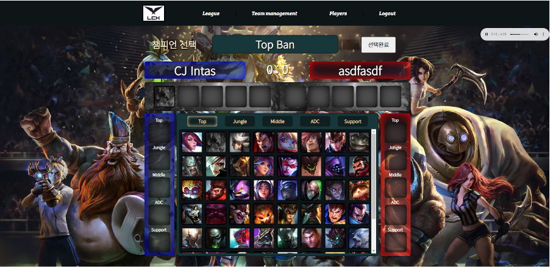
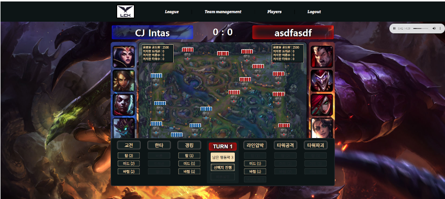

LCK Esports Manager
==========

 

CAU 2021-2 Capstone Design Project Repository

개요
--------

 

LoL이라고 불리는 **League of Legends**는 세계최고의  MOBA(Multiplayer Online Battle Arena) 게임으로 두팀으로 나누어 이루어지는 실시간 전투와 협동을 통한 팀플레이가 인상적인 게임입니다.
 

**LCK** (League of Legends Champions Korea) 라고 불리는 한국 LoL e스포츠 대회는 평균 시청자수 83만명을 기록할 정도로 전 세계적으로 높은 관심을 보이고 있습니다. 
  

이와 관련하여 **LCK Esports Manager**는 LoL 기반 2차 컨텐츠 게임으로 LoL과 함께 높은 관심을 보이는 e스포츠 대회를 접목하여 LoL을 즐기는 유저들에게 더 다양한 수요를 충족해주고 색다른 재미를 선보일 수 있습니다. 기존 LoL유저 중에서도 LCK 주시청자인 20~30대 남성을 주요 타켓층으로 삼았으며, 자신만의 리그팀을 결성하고 대결하는 방식을 통해 LoL을 즐길 수 있는 또 하나의 방법을 제공합니다.

기능
--------

 

* 메인페이지

 

 

    - 게임에 대한 설명, 매치 스케줄이 나타납니다.

    - 다른 페이지로 갈 수 있는 리그, 팀 관리, 플레이어, 로그인 탭이 있습니다.

    - 플레이어의 매치 스케줄 일정이 어떻게 되는지 확인할 수 있습니다.
 
 

* 선수 도감 및 팀 생성

 
 

 

    - Lck Esports Manager에 등록되어 있는 LCK의 선수들을 볼 수 있습니다.

    - 팀, 연도, 등급 으로 따라 선수들을 보여줍니다.

    - 주어진 금액으로 포지션 당 하나씩 선수들을 영입하여 팀을 생성하는 페이지입니다.
 
 

* 팀 관리 및 선수 관리

 
 

 

    - 팀의 사업관리 및 주전 선수 등록을 할 수 있는 페이지입니다.

    - 선수의 레벨, 능력치 등을 확인할 수 있습니다.
 
 

* 스케줄 진행

 

 

    - 리그 외에 헬스, 스트리밍, 휴식등의 활동 중 하나를 선택할 수 있습니다.
 
 

* 게임 진행

 
 

 

    - 챔피언 밴픽을 진행하고 선택지에 따라서 게임을 진행합니다.

    - 현재 게임 진행 상황에 따라서 승부를 예측하는 기능이 있습니다.
 

구현
--------

 

* Web FE
    - React, html, css
 

* Web BE
    - Django Rest FrameWork
    - Django
 

* AI for Match Prediction
    - Tensorflow
    - Jupyter Notebook
 

* Infra
    - AWS EC2
    - AWS RDS
    - My SQL

